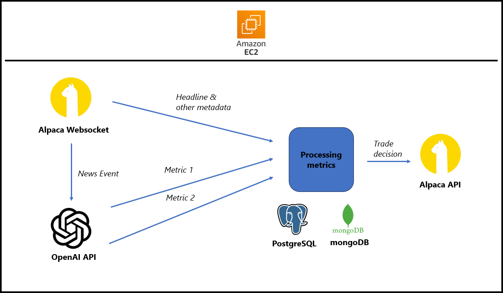

## Documentation

### Current System Logic
1. Receive a news event via Alpaca's websocket
2. Get headline of news event
3. Process headline through OpenAI's API
4. Execute Trading Logic (buy or close position)

### Ideal System Design

### Ideal System Logic
1. Receive a news event via Alpaca's websocket
2. Get headline of news event
3. Parse headline through OpenAI's API to gather some metrics
4. Process the metrics (Post-OpenAI)
5. Execute Trading Logic (long, short or ignore)
6. Log to database
7. Deployment to AWS EC2, Elastic Beanstalk, ECS, etc. (long-running compute)

### To Do
0. Restructuring of code:
    * Create a parameters file that stores the parameters
1. Parsing of headline
    * Based on a set of metrics (confidence of the headline, etc.), use the API to assess the headline and determine the values 
2. Processing of metrics
    * Based on the numerical values of the metrics gathered, evaluate the overall long/short metric
3. Trading Logic:
    * Risk management:
        - In a long position: When the stock has risen 10% or fallen 5%, close the trade
        - In a short position: When the stock has fallen 10% or risen 5%, close the trade
    * Trading window:
        - Set some time window based on research (backtesting, etc.)
4. Logging to Database:
    * Headline & other Metadata
    * Metrics
    * Trading Decision
5. Deployment

### Technical details
1. Add your own `.env` file (Alpaca and OpenAI keys)
2. To start server application, run `node server.js`

### Credits
- Cooper Codes for the skeleton structure