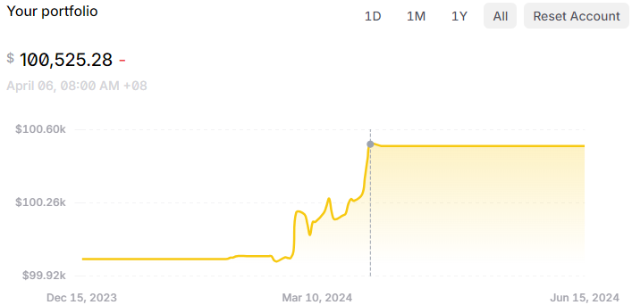

## Documentation

### Results

### Updates
25 May: Changed the direction of the project -- from backtesting the GPT strategy to implementing a control strategy.

### System Architecture

### Technical details
1. Update sample `.env` file
2. Run `main.py` to spin up the trading bot

### System Logic
1. Receive a news event via Alpaca's websocket
2. Get headline of news event
3. Parse headline through OpenAI's API to gather some metrics
4. Process the metrics (Couple Sentiment with something like MACD crossover, etc.)
5. Execute Trading Logic (long, short or ignore)
6. Log to database

### To Do
1. Aggregation of all metrics
2. Trading Logic:
    * Trading window:
        - Set some time window based on research (backtesting, etc.)
3. Backtesting with Historical News Data
4. Deployment