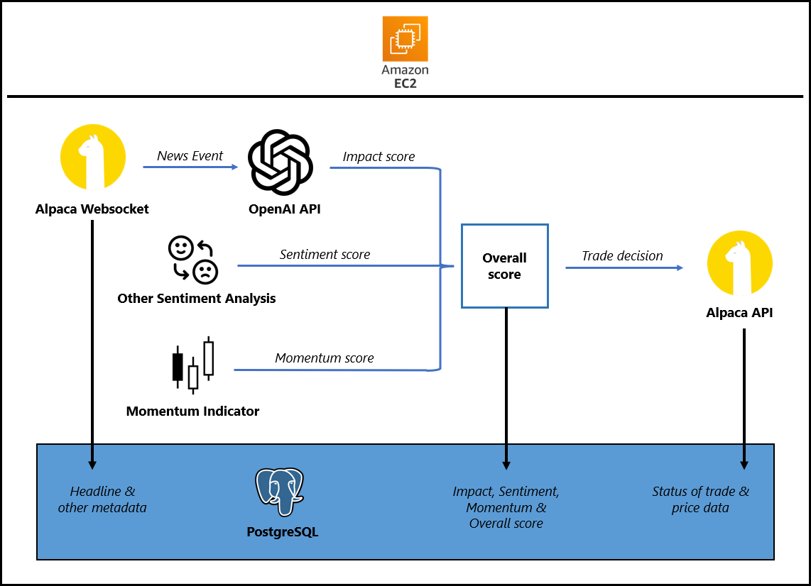

## Documentation

### Ideal System Design

### Ideal System Logic
1. Receive a news event via Alpaca's websocket
2. Get headline of news event
3. Parse headline through OpenAI's API to gather some metrics
4. Process the metrics (Post-OpenAI)
5. Execute Trading Logic (long, short or ignore)
6. Log to database
7. Deployment to AWS EC2, Elastic Beanstalk, ECS, etc. (long-running compute)